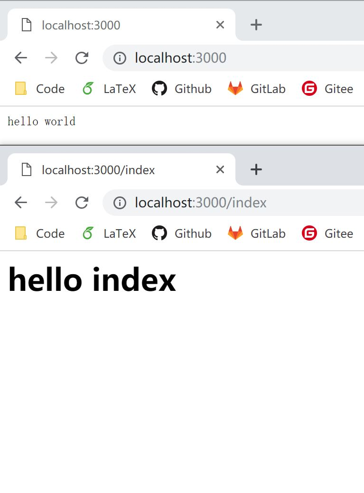

# 2.2 koa-router

自制的路由，总有一种很傻的感觉，因为每一次我们都需要判断 URL，不正确调用 next，进行下一层处理，直至找到正确的处理函数。

这里，介绍一个别人写好的中间件：[koa-router](https://www.npmjs.com/package/koa-router)。它可以帮助我们更加关注 URL 处理本身，而无需在编写函数时分心调用顺序等问题。

首先，安装 koa-router
```bash
npm install koa-router
```

来看一个实例：
```javascript
const koa = require('koa');
const router= require('koa-router')();

const app = new koa();

router.get('/', (ctx, next) => {
  ctx.response.body = 'hello world';
});

router.get('/index', (ctx, next) => {
  ctx.response.body = `<h1>hello index</h1>`;
});

app.use(router.routes());

app.listen(3000);
```

再次访问一下：


有了 koa-router 中间件，我们还可以做更棒的事情：把我们的代码组织的更加有逻辑结构(参照[项目重构](../struct/struct.md)，初学的小伙伴可以循序渐进~)！