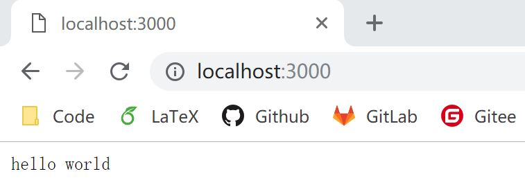

# 1.1 Hello World

## 环境准备

1. [node.js](https://nodejs.org) >= 7.6
2. npm >= 6.0

## Hello World

首先，我们利用 npm 初始化项目的 package.json 文件
*可以全部选择默认，更具体的配置选项可以查看 [package.json](http://caibaojian.com/npm/files/package.json.html) 的介绍*
```bash
npm init
```

然后，安装 koa
```bash
npm install koa
```

创建一个 app.js 文件，并写入如下代码：
```javascript
const koa = require('koa');
const app = new koa();

app.use(async (ctx) => {
  ctx.body = 'hello world';
});

app.listen(3000, () => {
  console.log('Koa running at port 3000...');
});
```

接下来，启动我们的 koa server
```bash
node app.js
```

接着我们就可以访问 http://localhost:3000 看到我们的 hello world~
