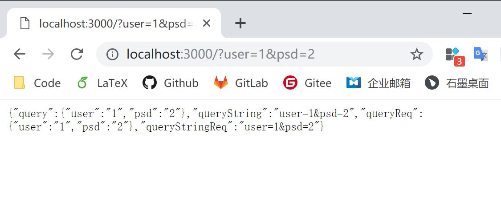

# 3.1 GET

目前为止，都还不错。我们可以得到一个十分简单的页面。那么，你可能会问，如何从 koa server 获取数据？其实，我们一开始的 Hello World，就是从 koa server 获取了一次数据。不过，我们常常会带上一系列数据来进行查询。下面，我们来看看如何处理这种 GET 请求。

```javascript
const koa = require('koa');

const app = new koa();

app.use(async ctx => {
  let query = ctx.query;
  let queryString = ctx.querystring;
  let queryReq = ctx.request.query;
  let queryStringReq = ctx.request.querystring;
  ctx.body = {
    query: query,
    queryString: queryString,
    queryReq: queryReq,
    queryStringReq: queryStringReq
  }
});

app.listen(3000, () => {
  console.log('Koa running at port 3000...');
});
```

我们来看看结果如何，我们在浏览器输入 http://localhost:3000/?user=123&psd=123 测试一下：



koa 已经把 ctx 包装了，我们可以直接从 ctx 获取 query/querystring，也可以从 ctx 获取 request 后，再获取 query/querystring