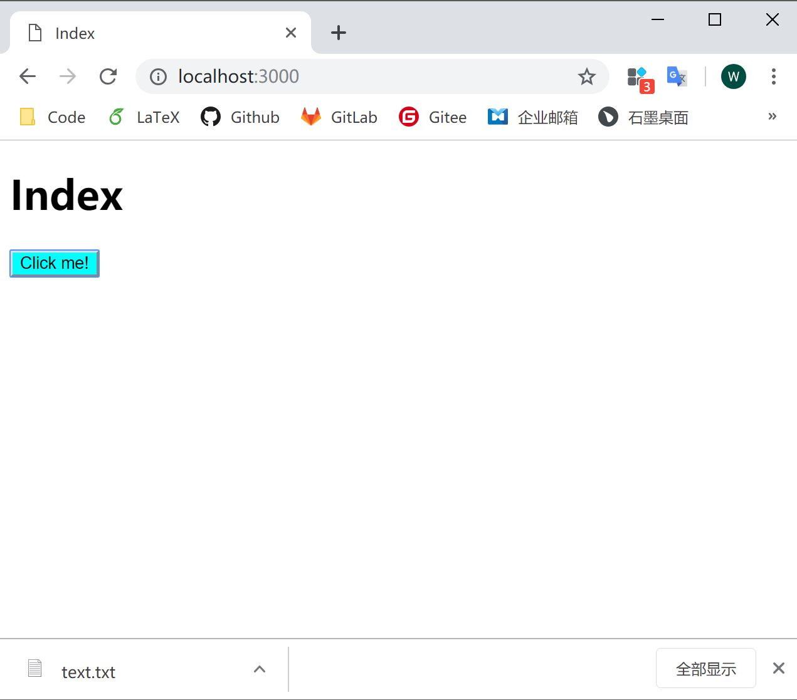

# 4.2 文件上传/下载

## 下载

在上一节基础上我们来看看如何下载文件。我们先在根目录下，新增一个 download 目录，并且放入一个 text.txt，然后更改 index.js 和 app.js 试验一下。

```javascript
// index.js
document.getElementById('btn').onclick = () => {
  window.open('/download/text.txt', '_blank');
};
```

```javascript
// app.js
const koa = require('koa');
const router = require('koa-router')();
const static = require('koa-static');
const path = require('path');
const nunjucks = require('nunjucks');
const send = require('koa-send');

const app = new koa();

let env = nunjucks.configure('views'); // path to model file folder

router.get('/', (ctx, next) => {
  ctx.response.body = env.render('index.html', {
    title: 'Index'
  });
});

router.get('/download/:filename', async (ctx, next) => {
  let filename = ctx.params.filename;
  let filePath = `./download/${filename}`; // download file folder relative to app.js
  ctx.attachment(filePath); // mime type, active the download window in browser
  await send(ctx, filePath);
});

app.use(router.routes());

app.use(static(path.join( __dirname,  './static')));


app.listen(3000, () => {
  console.log('Koa running at port 3000...');
});
```

弹窗下载成功~



## 上传

现在我们可以从服务器下载文件了，那么，我们要如何上传呢？我们需要之前在 POST data 使用过的 koa-body 来帮忙，因为 koa 并不解析 post 的数据，而 koa-body 帮我们处理好了各种 post 情况。然后，我们新增一个处理上传文件的路由，来处理上传的文件。

```javascript
// app.js
const koa = require('koa');
const router = require('koa-router')();
const static = require('koa-static');
const send = require('koa-send');
const body = require('koa-body');
const nunjucks = require('nunjucks');

const fs = require('fs');
const path = require('path');

const app = new koa();

let env = nunjucks.configure('views'); // path to model file folder

app.use(body({  // options to handle the post file
  multipart: true,
  formidable: {
      maxFileSize: 200*1024*1024    // the max size of uploading file
  }
}));

router.get('/', (ctx, next) => {  // index router
  ctx.response.body = env.render('index.html', {
    title: 'Index'
  });
});

/**
 * Save the upload file
 * @param {file} file: the file to be saved
 */
function saveFile(file) {
  const reader = fs.createReadStream(file.path);
  let filePath = path.join(__dirname, 'upload/') + `/${file.name}`;
  const upStream = fs.createWriteStream(filePath);
  reader.pipe(upStream);
}

router.post('/upload', async (ctx, next) => { // handle the upload files
  console.log(ctx.request.files);
  const files = ctx.request.files.file; // file: id of the input
  if (files.length > 1) { // list of files
    for (let file of files) {
      saveFile(file); 
    }
  } else if (files) { // single file
    saveFile(files);
  }

  ctx.body = 'Upload successfully.';
});

app.use(router.routes());

app.use(static(path.join( __dirname,  './static')));

app.listen(3000, () => {
  console.log('Koa running at port 3000...');
});
```

页面上增加一下上传文件的按钮：

```html
<!DOCTYPE html>
<html lang="en">
<head>
  <meta charset="UTF-8">
  <meta name="viewport" content="width=device-width, initial-scale=1.0">
  <meta http-equiv="X-UA-Compatible" content="ie=edge">
  <title>{{ title }}</title>
</head>
<body>
  <h1>{{ title }}</h1>
  <form action="http://localhost:3000/upload" method="post" enctype="multipart/form-data">
    <input id="file" type="file" name="file" value="" multiple="multiple" />
    <button id="upload" type="submit">Upload</button>
  </form>
  <button id="btn">Click me!</button>
</body>

<link rel="stylesheet" type="text/css" href="css/index.css">
<script src="js/index.js"></script>
</html>
```

好了，我们来试验一下：


**上传文件是个很敏感的操作，因为很可能会带有恶意文件，所以存储文件的函数需要自己定制化**