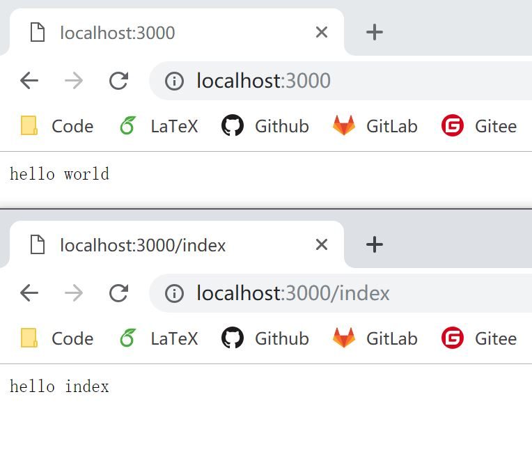

# 2.1 自制路由

我们现在可以处理来自 http://localhost:3000 的请求，但如果我们是 http://localhost:3000/index 呢？
这就需要路由处理了。之前说过，koa 的 ctx 是对 HTTP request 和 response 的包装，那么解决方案来了：
```javascript
app.use(async (ctx, next) => {
  if (ctx.request.path === '/') {
    ctx.response.body = 'hello world';
  } else {
    await next();
  }
});

app.use(async (ctx, next) => {
  if (ctx.request.path === '/index') {
    ctx.response.body = 'hello index';
  } else {
    await next();
  }
});
```

再次运行，我们来看看结果：
