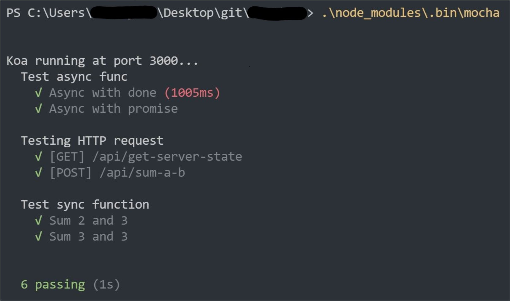

# 8.1 Mocha/Chai/Supertest

测试，很多人都不陌生。出名的测试框架有很多，jasmine，karma，mocha 等。无论使用哪一种框架，功能都是一样的。这里我介绍一下 [mocha](https://mochajs.org/)，因为它支持定向测试(运行特定测试样例)和同步/异步测试，同时具有一些便于使用的测试 hook。

## 安装测试框架

```bash
npm install mocha chai supertest
```

## 测试库介绍

- chai
  chai 提供了一套语义化的断言机制，你可以使用 `expect(sth).to.be(sth)`，`sth.should.not.be(sth)` 或者 `assert.equal(sth, sth)` 三种语义化风格的断言机制。
- mocha
  mocha 使用如下框架来测试：
  ```javascript
  describe('Test module', function() {
    it('sub module 1', function() {
      // assert
    });

    it('sub module 2', function() {
      // assert
    });
  });
  ```
  每一个 describe 是一个测试模块，里面定义的 it 是测试模块中的小模块，也就是具体的测试样例。
- supertest
  supertest 是辅助 mocha 进行 HTTP 请求的测试库，它包装了模拟 HTTP 请求的函数，使得网络测试变得十分简单。

## 代码样例

我们新建一个工程，目录如下：
```
├─test
│  ├─sync_test.js
│  ├─async_test.js
│  └─http_test.js
├─package.json
├─sum.js
└─app.js
```

*测试代码均放置在 test 目录下*

### 同步测试

我们利用 [chai](https://www.chaijs.com/) 提供的断言于 mocha 的测试框架来实现同步测试。

下面我们来看看同步函数是如何测试的：

```javascript
// sync_sum.js
module.export = function(a, b) {
  return a + b;
}
```

```javascript
// sync_test.js
const chai = require('chai');
const sum = require('../sum');

describe('Test sync function', () => {
  it('Sum 2 and 3', () => {
    chai.expect(sum(2, 3)).to.be(5);
  });
  
  it('Sum 3 and 3', () => {
    chai.expect(sum(3, 3)).to.be(6);
  });
});
```

### 异步测试

JavaScript 最令人喜欢，也最令人痛恨的异步机制，而 mocha 对于异步函数有着十分优秀的支持机制。你可以选择两种方式来完成异步测试：
1. 利用 `done` 回调函数
    在异步函数中，我们显示的调用一个 `done` 函数，就可以通知 mocha 这个异步函数的完成情况。这样就不用一直等待异步函数执行情况。
2. 直接使用 `promise`
    mocha 支持直接返回一个 promise，通过 promise 的 resolve 还是 reject 来判断这个测试是否通过。

在**mocha 6.0.0**以后，返回 promise 时，再调用 done 是非法行为，该测试不会通过。但在这个版本以前，mocha 会自动略过 promise 中的 done 函数。

```javascript
// async_test.js
const chai = require('chai');
const fs = require('fs');

let read = function (filename) {
  let promise = new Promise(function(resolve, reject) {
    fs.readFile(filename, 'utf8', function(err, data) {
      if (err){
        reject(err);
      }
      resolve(data);
    });
  });
  return promise;
}

describe('Test async func', () => {
  it('Async with done', function(done) {
    let x = true;
    let f = function() {
      x = false;
      chai.expect(x).to.be.not.ok;
      done(); // inform mocha test done
    };
    setTimeout(f, 4000);
  });
  
  it('Async with promise', async () => {
    // return read('sum.js') is supported for promise
    // but here I'd like to change it into
    // sync way which could be more controlled
    let data = await read('sum.js');
    chai.expect(data).to.not.be.a('null');
  });
});
```

### HTTP 测试

HTTP 测试借助 supertest 会变得十分方便。我们只需要将运行的 koa server 作为参数传递给 supertest，它就会知道请求发送的地址。然后我们可以通过 supertest 模拟请求，并且判断请求的结果是否符合预期。因为 HTTP 请求是异步的，所以 supertest 还是需要调用 done 的。

```javascript
// app.js
const koa = require('koa');
const body = require('koa-body');
const router = require('router')();

const app = new koa();

// request data parser
app.use(koaBody());

// routers
router.get('/api/get-server-state', (ctx, next) => {
  ctx.response.body = {
    msg: 'Server is ok.'
  };
});

router.post('/api/sum-a-b', (ctx, next) => {
  let a = ctx.request.body.a;
  let b = ctx.request.body.b;
  ctx.response.body = {
    res: a + b
  };
});

app.use(router.routes());

module.exports = app;

app.listen(3000, () => {
  console.log('Koa running at port 3000...');
});
```

```javascript
// http_test.js
const app = require('../app');
const request = supertest(app.listen());

describe('Test HTTP request', () => {
  it('[GET] /api/get-server-state', (done) => {
    request.get('/get-server-state')
      .send()
      .expect(200, { msg: 'Server is ok.' }, done);
  });
  
  it('[POST] /api/add-a-b', (done) => {
    request.post('/api/sum-a-b')
      .set('Content-Type', 'application/json')
      .send({ a: 2, b: 3 })
      .expect(200, { res: 5 }, done);
  });
});
```

### 测试结果

输入 `.\node_modules\.bin\mocha`，mocha 会自动运行 test 目录下所有的测试文件。当然，你可以在 `package.json` 中加入 test script：
```json
"scripts": {
  "test": "./node_modules/.bin/mocha",
}
```
这样就可以直接通过 `npm test` 直接进行测试。

我们前面的测试代码结果如下：



### 更进一步

一开始说过，mocha 可以指定运行测试样例，如果我们使用 `npm test`，怎么办呢？很简单，我们可以在 test 目录下，添加一个 `mocha.opts` 文件，这里面写下你希望运行 mocha 的时候添加的参数，比如异步函数的等待执行时间等。

下面的文件就指定了只运行 test_program.js 测试文件，并且指定了测试报告主题。更多参数设置可以前往 [mocha](https://mochajs.org/) 的官网进行查看
```text
test/test_program.js
--reporter landing
```