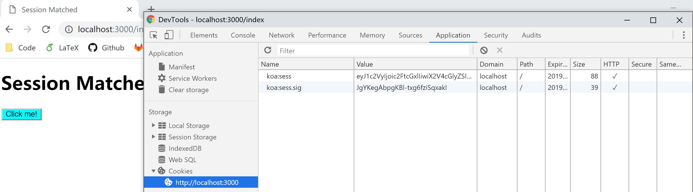

# 5.2 session

Koa 只提供了 cookies 的操作，对于 session，并没有包装。这里我们使用第三方库：[**koa-session**](https://www.npmjs.com/package/koa-session)。它可以帮我们在 koa 中添加 `ctx.session` 操作，用起来就像是 koa 集成了 session 操作。

为什么会选择这个库呢？我们先来看看这个库里对于 session 存储的说明：https://www.npmjs.com/package/koa-session#external-session-stores 。它提倡**尽量将 session 存储在 cookies 中**，如果需要外部存储，可以传递一个 `store:{ get(key, maxAge, { rolling }), set(key, sess, maxAge, { rolling, changed }), destroy(key)}`。我个人认为的这个库的优点之一：不限制外部存储数据库。

对于将 session 存储在 cookies 里这个观点，和近年来 session 存储的开销日益增大是有一定关系的。没有接触过企业项目的我，也不好过多评价。对于我们自己写的小项目，不涉及敏感信息的话，存储在 cookies 里是很方便的~

## koa-session

好了，下面我们来实践一下，利用 session 来控制一下可访问的页面。

我们首先在最前面使用 koa-session 库，然后对请求进行拦截。拦截的思想是：`/` 和 `/get-session` 是不需要验证 session 的(未登录用户可以访问的页面)，而 `/index` 是具有 session (登陆用户)才可以访问的。 

```javascript
const koa = require('koa');
const router = require('koa-router')();
const static = require('koa-static');
const session = require('koa-session');
const nunjucks = require('nunjucks');

const path = require('path');

const app = new koa();

// Add session middleware
app.keys = ['com.w-sfs' + Math.random().toString()];  /** Different key every time server start */
const SESSION_CONFIG = {
  key: 'koa:sess', /** (string) cookie key (default is koa:sess) */
  /** (number || 'session') maxAge in ms (default is 1 days) */
  /** 'session' will result in a cookie that expires when session/browser is closed */
  /** Warning: If a session cookie is stolen, this cookie will never expire */
  maxAge: 86400000,
  autoCommit: true, /** (boolean) automatically commit headers (default true) */
  overwrite: true, /** (boolean) can overwrite or not (default true) */
  httpOnly: true, /** (boolean) httpOnly or not (default true) */
  signed: true, /** (boolean) signed or not (default true) */
  rolling: false, /** (boolean) Force a session identifier cookie to be set on every response. The expiration is reset to the original maxAge, resetting the expiration countdown. (default is false) */
  renew: false, /** (boolean) renew session when session is nearly expired, so we can always keep user logged in. (default is false)*/
};
app.use(session(SESSION_CONFIG, app));
app.use(async (ctx, next) => {
  let url = ctx.request.url;
  if (url === '/get-session' || url === '/') { // non-session request
    ctx.session.user = null;
    await next();
  } else if (url.includes('js') || url.includes('css') || url.includes('image')) {  // static files
    await next();
  } else { // session needed
    if (ctx.session.user && ctx.session.user === 'sample') { // session match
      await next();
    } else { // session mismatch
      ctx.redirect('/');
    }
  }
});

let env = nunjucks.configure('views'); // path to model file folder

router.get('/', (ctx, next) => {
  ctx.response.body = 'Go to /get-session first';
});

router.get('/get-session', (ctx, next) => {
  ctx.session.user = 'sample';
  ctx.redirect('/index');
});

router.get('/index', (ctx, next) => {
  ctx.response.body = env.render('index.html', {
    title: 'Session Matched'
  });
});

app.use(router.routes());

app.use(static(path.join( __dirname,  './static')));

app.listen(3000, () => {
  console.log('Koa running at port 3000...');
});
```

试一下直接访问 http://localhost:3000/index ，服务器会直接重定向到 http://localhost:3000 ，因为我们还没有 session (登陆)。接着，访问 http://localhost:3000/get-session ，然后我们就可以正常访问 http://localhost:3000/index 了。浏览器里也留下了我们的 session 凭据：

